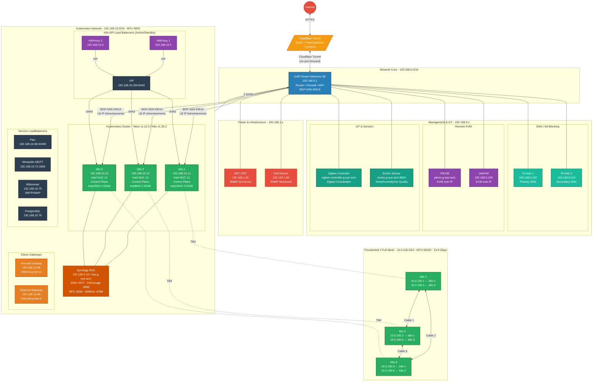
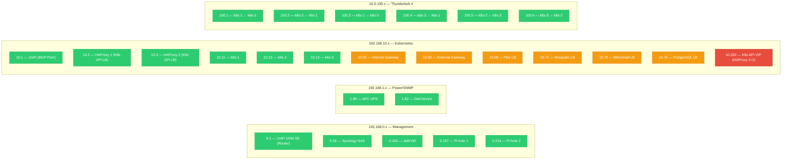

<div align="center">


## My Home Operations repository

_... managed by Flux, Renovate and GitHub Actions_ :robot:

<div align="center">

[](https://status.g-eye.io)&nbsp;&nbsp;
[](https://status.g-eye.io)&nbsp;&nbsp;
[](https://status.g-eye.io)

</div>

</div>

<div align="center">

[](https://github.com/kashalls/kromgo)
[](https://github.com/kashalls/kromgo)
[](https://github.com/kashalls/kromgo)
[](https://github.com/mgueye01/home-ops/commits/main)
[](https://github.com/pre-commit/pre-commit)
[](https://github.com/mgueye01/home-ops/actions/workflows/renovate.yaml)
<!-- [](https://github.com/renovatebot/renovate) -->

</div>

<div align="center">

Main k8s cluster stats:

[](https://github.com/kashalls/kromgo)&nbsp;&nbsp;
[](https://github.com/kashalls/kromgo)&nbsp;&nbsp;
[](https://github.com/kashalls/kromgo)&nbsp;&nbsp;
[](https://github.com/kashalls/kromgo)&nbsp;&nbsp;
[](https://github.com/kashalls/kromgo)&nbsp;&nbsp;
[](https://github.com/kashalls/kromgo)&nbsp;&nbsp;
[](https://github.com/kashalls/kromgo)

---

</div>

A GitOps-managed Kubernetes home lab running production-grade infrastructure for home automation, media services, and personal applications on a 3-node Intel NUC cluster.

## Table of Contents

- [Architecture](#architecture)
- [Hardware](#hardware)
- [Networking](#networking)
  - [Network Topology](#network-topology)
  - [IP Address Allocation](#ip-address-allocation)
  - [Domains & DNS](#domains--dns)
- [Storage](#storage)
- [Directory Structure](#directory-structure)
- [Applications](#applications)
- [GitOps Workflow](#gitops-workflow)
- [Secrets Management](#secrets-management)
- [Observability](#observability)
- [Build System](#build-system)
- [Conventions](#conventions)
- [Further Reading](#further-reading)

## Architecture

| Layer | Technology |
|-------|-----------|
| OS | Talos Linux v1.12.x |
| Kubernetes | v1.35.x |
| CNI | Cilium (Direct Routing, kube-proxy replacement) |
| GitOps | Flux CD v2 |
| Storage | Rook-Ceph, OpenEBS, NFS CSI |
| Databases | CloudNative-PG (PostgreSQL), Redis |
| Secrets | SOPS + age encryption, 1Password via External Secrets |
| Certificates | cert-manager |
| Backups | Volsync + Kopia (hourly snapshots, 7-day retention) |
| Monitoring | Prometheus, Grafana, Victoria Logs, Fluent-Bit |
| Dependency Updates | Renovate |
| CI/CD | GitHub Actions (self-hosted runners) |
| Build System | Just |

All three nodes serve as control-plane members with workload scheduling enabled (`allowSchedulingOnControlPlanes: true`), forming a fully converged cluster with no dedicated workers.

## Hardware

**3x Intel NUC 12 (Wall Street Canyon)**

| Node | Role | Storage | Network |
|------|------|---------|---------|
| k8s-1 | Control-plane + worker | Crucial CT480BX500SSD1 | 2.5GbE + Thunderbolt 4 |
| k8s-2 | Control-plane + worker | Crucial CT480BX500SSD1 | 2.5GbE + Thunderbolt 4 |
| k8s-3 | Control-plane + worker | Crucial CT480BX500SSD1 | 2.5GbE + Thunderbolt 4 |

All nodes include Intel iGPU (Meteor Lake) with hardware acceleration support via the Intel Device Plugin Operator.

## Networking

### Network Topology



### IP Address Allocation



### Network Summary

| Network | Subnet | MTU | Purpose |
|---------|--------|-----|---------|
| Management | 192.168.0.0/24 | 1500 | DNS, KVM, IoT, NAS |
| Power/SNMP | 192.168.1.0/24 | 1500 | UPS, infrastructure monitoring |
| Kubernetes | 192.168.10.0/24 | 9000 | K8s nodes, API, services, Ceph public |
| Thunderbolt 4 | 10.0.100.0/24 | 65520 | Ceph OSD replication (15.8 Gbps) |
| Pod CIDR | 10.42.0.0/16 | — | Kubernetes pod network |
| Service CIDR | 10.43.0.0/16 | — | Kubernetes service network |

### Domains & DNS

| Domain | Provider | Purpose |
|--------|----------|---------|
| `*.g-eye.io` | Cloudflare (external) + UniFi (internal) | All Kubernetes services (60+ subdomains) |
| `*.g-eye.tech` | Manual/static | Non-K8s infrastructure (NAS, Pi-hole, PiKVM, UniFi, Enviro, Zigbee) |

### External Ingress
- **Cloudflare Tunnel** (QUIC, post-quantum) provides secure ingress without exposing ports
- **Cilium Gateway API** with internal (192.168.10.50) and external (192.168.10.60) gateways
- **BGP** between Cilium (ASN 64514) and UniFi (ASN 64513) for LoadBalancer IP advertisements

> Full network documentation with service maps: [`docs/network-map.md`](docs/network-map.md)

## Storage

| System | Purpose |
|--------|---------|
| Rook-Ceph | Distributed block/object storage across all nodes |
| OpenEBS | Alternative local storage provisioner |
| NFS CSI | Network-attached storage for bulk data |
| Volsync + Kopia | PVC backup and cross-cluster migration |

**Backup stats**: 23 applications backed up, 350+ Gi protected, hourly snapshots with 7-day retention. RPO: 1 hour, RTO: minutes to hours.

Volsync components are reusable across applications via Kustomize templates in `kubernetes/components/volsync/`.

## Directory Structure

```
home-ops/
├── talos/                         # Talos Linux node configuration
│   ├── machineconfig.yaml.j2      #   Shared machine config (Jinja2 template)
│   ├── nodes/                     #   Per-node patches (k8s-1, k8s-2, k8s-3)
│   │   └── *.yaml.j2
│   ├── schematic.yaml             #   Extensions and kernel arguments
│   └── mod.just                   #   Talos-specific just commands
│
├── kubernetes/                    # All Kubernetes manifests
│   ├── apps/                      #   Application deployments by namespace
│   │   ├── default/               #     User-facing apps (~35 applications)
│   │   ├── databases/             #     PostgreSQL, Redis
│   │   ├── observability/         #     Monitoring and logging stack
│   │   ├── network/               #     Cloudflare, DNS, tunnels
│   │   ├── kube-system/           #     Core cluster services
│   │   ├── security/              #     cert-manager, etc.
│   │   ├── dev/                   #     Development tools
│   │   ├── rook-ceph/             #     Ceph storage cluster
│   │   ├── flux-system/           #     Flux CD itself
│   │   └── volsync-system/        #     Backup orchestration
│   ├── components/                #   Reusable Kustomize components
│   │   ├── common/                #     Shared patches
│   │   ├── volsync/               #     Backup templates (PVC, etc.)
│   │   └── keda/                  #     Autoscaling configs
│   └── flux/                      #   Flux GitOps configuration
│       └── mod.just               #   Kubernetes just commands
│
├── bootstrap/                     # Cluster bootstrapping
│   ├── helmfile.d/                #   Declarative Helm releases for initial setup
│   └── resources.yaml.j2          #   Bootstrap resource template
│
├── docs/                          # Extended documentation
│   ├── README.md                  #   Documentation index
│   ├── volsync-migration-guide.md #   Cluster migration (2,150+ lines)
│   ├── monitoring.md              #   Monitoring setup
│   └── runbooks/                  #   Operational runbooks
│
├── openclaw-custom/               # Custom Docker image with Git integration
├── .justfile                      # Main build system entrypoint
├── .renovaterc.json5              # Automated dependency update config
├── .sops.yaml                     # Secrets encryption configuration
└── .pre-commit-config.yaml        # Git hooks (shellcheck, etc.)
```

### Application Layout Pattern

Each application follows a consistent structure:

```
kubernetes/apps/<namespace>/<app-name>/
├── ks.yaml                # Flux Kustomization resource
└── app/
    ├── kustomization.yaml # Kustomize config (resources, generators)
    ├── helmrelease.yaml   # Helm chart configuration
    ├── ocirepository.yaml # OCI Helm chart source (or helmrepository.yaml)
    └── pvc.yaml           # Persistent volume claim (if stateful)
```

Namespace-level `kustomization.yaml` files aggregate all apps in that namespace. Applications can be enabled/disabled by commenting entries in these files.

## Applications

### Media & Entertainment
Plex, Radarr, Sonarr, Bazarr, Prowlarr, SABnzbd, Jellyseerr, Tautulli, Beets, Kometa, RecyclArr, Recommendarr

### Home Automation
Home Assistant, Mosquitto (MQTT broker)

### Productivity & Content
Nextcloud (files/contacts/calendar), Paperless + Paperless-AI (document management), Blog, Atuin (shell history sync)

### Workflow Automation
N8N (visual workflow automation), OpenClaw

### CRM & Business
LeLabo CRM, Twenty (CRM/ERP), Fusion

### Utilities
Homepage (dashboard), Changedetection (website monitoring), Shlink (URL shortener), LittleLinks, Open-WebUI (LLM interface), Notifier, Rybbit

### Databases
CloudNative-PG (PostgreSQL operator), PGAdmin, Redis (general + dedicated LeLabo instance)

### Observability
Prometheus + kube-prometheus-stack, Grafana, Victoria Logs, Fluent-Bit, Karma, Gatus, SmartCTL Exporter, SNMP Exporter, Blackbox Exporter, Unpoller, Teslamate, Kromgo, KEDA, Silence Operator, UptimeRobot

### Network
Cloudflare DNS, Cloudflare Tunnel, Unifi DNS, Echo

### System
cert-manager, CSI NFS Driver, Intel Device Plugin Operator, Metrics Server, Reloader, Snapshot Controller, Actions Runner System, Volsync, Flux

## GitOps Workflow

All cluster state is declared in this repository and reconciled by **Flux CD**.

### How Changes Are Applied

1. Push a commit to the `main` branch
2. Flux detects the change via its `GitRepository` source (polled or webhook-triggered)
3. Flux reconciles `Kustomization` resources, applying manifests to the cluster
4. Helm charts are deployed via `HelmRelease` resources referencing OCI or Helm repositories

### Flux Configuration

- **Reconciliation interval**: 1 hour (with 2-minute retry on failure)
- **Timeout**: 5 minutes
- **Decryption**: SOPS with age keys for encrypted secrets
- **Dependency ordering**: Child Kustomizations inherit SOPS decryption from the root

### Dependency Updates

**Renovate** automatically opens PRs for:
- Helm chart version bumps
- Container image tag updates
- GitHub Actions version updates
- Kubernetes manifest references

Configuration: `.renovaterc.json5` (semantic commits, Europe/Paris timezone, auto-merge capable)

## Secrets Management

Secrets follow a layered approach:

1. **SOPS + age**: Encrypts Kubernetes secrets in-repo (`.sops.yaml` defines encryption rules)
2. **External Secrets Operator**: Pulls secrets from 1Password at runtime using `op://` references
3. **Jinja2 templates**: Talos configs use `op inject` to resolve 1Password references during rendering

Secrets are never stored in plaintext in the repository.

## Observability

### Monitoring
- **Metrics**: Prometheus via kube-prometheus-stack, with specialized exporters (SmartCTL, SNMP, Blackbox, Unpoller)
- **Dashboards**: Grafana with pre-configured dashboards (e.g., K8s Volumes dashboard ID 11454)
- **Autoscaling**: KEDA for event-driven pod autoscaling

### Logging
- **Collection**: Fluent-Bit aggregates container and node logs
- **Storage**: Victoria Logs for centralized log querying
- **Application rules**: Loki monitoring rules generated via ConfigMap generators per application

### Alerting & Status
- **Alertmanager** with Karma UI for alert management
- **Silence Operator** for programmatic alert silencing
- **Gatus** for endpoint health monitoring
- **UptimeRobot** for external status page (status.g-eye.io)

## Build System

The repository uses [Just](https://github.com/casey/just) as its task runner, organized into modules:

| Module | File | Purpose |
|--------|------|---------|
| Main | `.justfile` | Entrypoint, imports modules |
| Talos | `talos/mod.just` | Node config rendering and application |
| Kubernetes | `kubernetes/flux/mod.just` | Flux sync, PVC browsing, pod management |
| Bootstrap | `bootstrap/` | Initial cluster setup with Helmfile |

### Key Commands

```bash
# Talos node management
just talos render-config <node>    # Render node config (requires 1Password)
just talos apply-node <node>      # Render + apply via talosctl

# Flux operations
just flux sync                    # Sync all Flux resources
just flux reconcile <resource>    # Force reconcile a specific resource

# Cluster utilities
just kubernetes browse-pvc        # Browse PVC contents
just kubernetes node-shell        # Open shell on a node
```

## Conventions

### Git
- **Branch**: `main` is production; all changes go directly to main
- **Commit style**: Conventional commits - `feat(scope)`, `fix(scope)`, `chore(scope)`
- **No co-authoring** on commits

### Kubernetes Manifests
- Applications are organized by namespace under `kubernetes/apps/`
- Each app has a `ks.yaml` (Flux Kustomization) and an `app/` directory for resources
- Reusable patterns live in `kubernetes/components/`
- Name suffix hashing is disabled in Kustomize configs
- Flux substitutions are disabled per-app to maintain predictable resource names

### Talos Configuration
- Shared config in `talos/machineconfig.yaml.j2`, per-node overrides in `talos/nodes/`
- Jinja2 templates with 1Password injection via `op inject`
- Node labels include GPU capability and topology zone information

### Application Patterns
- Stateful apps use Volsync for backup via reusable PVC components
- Helm charts are sourced from OCI registries where possible
- External Secrets pull credentials from 1Password
- Loki monitoring rules are generated per-app via ConfigMap generators

## Further Reading

- [`docs/network-map.md`](docs/network-map.md) - Full network cartography with service maps and DNS inventory
- [`docs/volsync-migration-guide.md`](docs/volsync-migration-guide.md) - Cluster migration with zero data loss (2,150+ lines)
- [`docs/monitoring.md`](docs/monitoring.md) - Monitoring and dashboard setup
- [`docs/runbooks/storage-full.md`](docs/runbooks/storage-full.md) - Storage full remediation
- [Flux Documentation](https://fluxcd.io/docs/)
- [Talos Linux Documentation](https://www.talos.dev/latest/)
- [Rook-Ceph Documentation](https://rook.io/docs/rook/latest/)
- [Volsync Documentation](https://volsync.readthedocs.io/)
