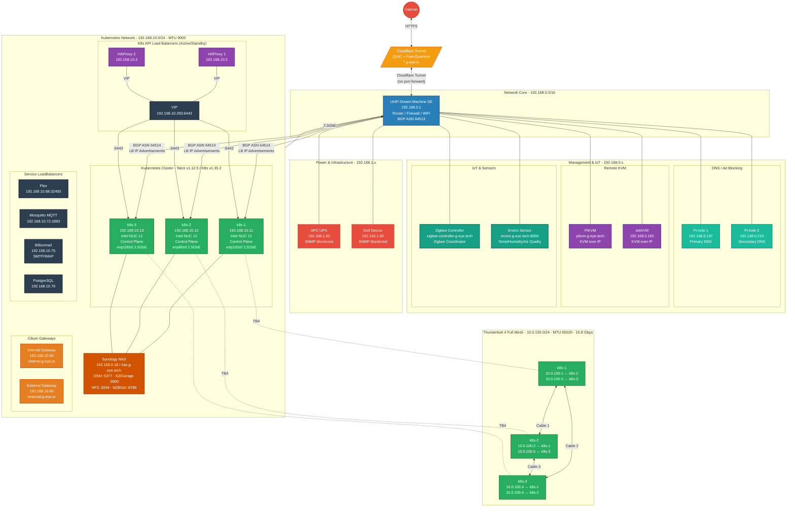
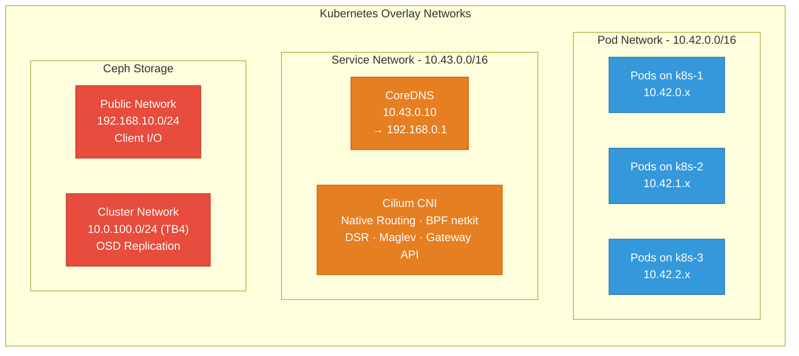
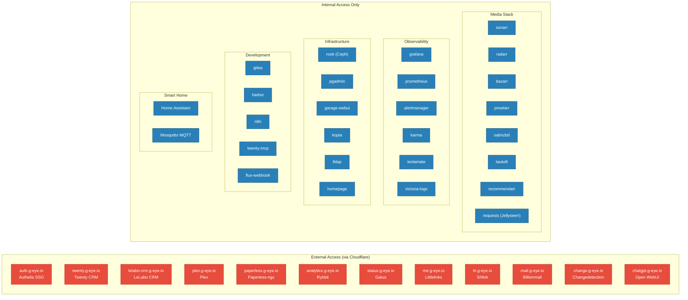
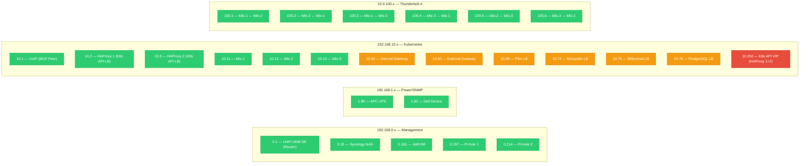

# Network Map - G-Eye Homelab

## Network Topology

## Kubernetes Internal Networks

## Services & Applications Map

## IP Address Allocation

## Domains & DNS

| Domain | Provider | Purpose |
|--------|----------|---------|
| `*.g-eye.io` | Cloudflare (external) + UniFi (internal) | All Kubernetes services |
| `*.g-eye.tech` | Manual/static | Non-K8s infrastructure devices |

### g-eye.tech Hostnames

| Hostname | Target | Device |
|----------|--------|--------|
| `nas.g-eye.tech` | 192.168.0.18 | Synology NAS |
| `pi-hole.g-eye.tech` | 192.168.0.197 | Pi-hole 1 |
| `pikvm.g-eye.tech` | PiKVM | KVM over IP |
| `unifi.g-eye.tech` | 192.168.0.1 | UniFi UDM SE |
| `enviro.g-eye.tech` | Enviro sensor | Environmental sensor |
| `zigbee-controller.g-eye.tech` | Zigbee coordinator | Smart home gateway |

### Key g-eye.io Subdomains (60+)

| Category | Subdomains |
|----------|-----------|
| **Business** | twenty, lelabo-crm, analytics, ln, me |
| **Media** | plex, sonarr, radarr, bazarr, prowlarr, sabnzbd, tautulli, requests, recommendarr |
| **Productivity** | paperless, paperless-ai, paperless-gpt, n8n, karakeep, chatgpt, feeds, change |
| **Observability** | grafana, prometheus, alertmanager, karma, status, teslamate, victoria-logs |
| **Infrastructure** | rook, pgadmin, garage-webui, kopia, auth, lldap, sh, mail |
| **Development** | gitea, harbor, twenty-mcp, flux-webhook |
| **Network** | internal, external, echo, kromgo, homepage |
| **Smart Home** | hass (Home Assistant) |
